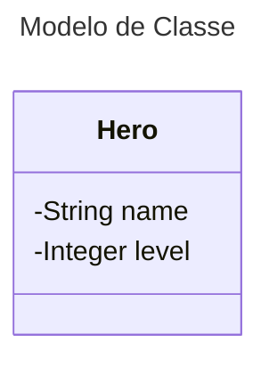

# Desafio do Felipão

```
Crie uma variável para armazenar o nome e a quantidade de experiência (XP) de um herói,
depois utilize uma estrutura de decisão para apresentar alguma das mensagens abaixo:

 Se XP for menor do que 1000 = Ferro
 Se XP for entre 1001 e 2000 = Bronze
 Se XP for entre 2001 e 5000 = Prata
 Se XP for entre 5001 e 7000 = Ouro
 Se XP for entre 5001 e 8000 = Platina Diamante
 Se XP for entre 8001 e 9000 = Ascendente
 Se XP for entre 9001 e 10000 = Imortal
 Se XP for maior ou igual a 10001 = Radiante

 Ao final deve se exibir uma mensagem:
 "O Herói de nome **{nome}++ está no nivel **@*"

```

Neste desafio fiz uso da linguagem Java. Criei uma entidade chamada Hero com os atributos nome e level.
Fiz uso de POO, estrutura de decisão, repetição, Lista...

Abaixo o Diagrama de Classe


